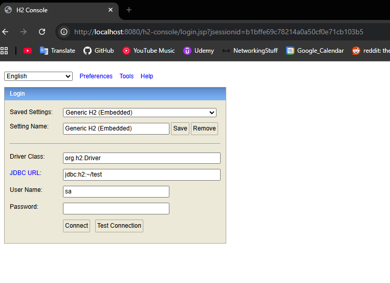
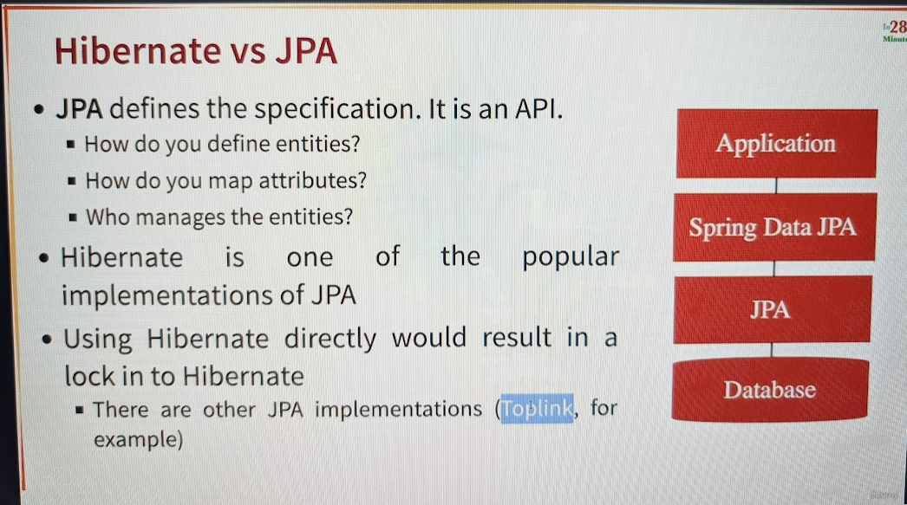

# Databases and Shit

## H2

H2 is a in-memory database. We will play around with it. When you include the H2 starter project, Spring does its plug 
and play magic. If you run this application with H2 starter project, it will automatically create the DB. You can view
the DB details in the start-up logs when you run this application with H2 enabled.

You'll see something that looks like:

`Added connection conn0: url=jdbc:h2:mem:eae25c24-5ec2-439e-bc2c-61bae6a81a6b`

That "URL" is the string we can use to connect to this in-mem database. We can enable the h2 console by addding the 
following to our application.properties: `spring.h2.console.enabled=true`

You can then run the application and go over to `localhost:8080/h2-console` and you get a web UI to acces the in-mem DB:



notice JDBC URL is set to `jdbc:h2:~/test` this is the default. We need to change this from that to what we get in the 
logs. Remember that should look something like `url=jdbc:h2:mem:eae25c24-5ec2-439e-bc2c-61bae6a81a6b`

Default username is `sa` with no password.

#### static url

You can also just set the url to anything you want. That will be set in the application.properties. you add the following:

`spring.datasource.url=jdbc:h2:mem:testdbname`

Now we can log in and do shit :)

### Creating Schemas...

I wasn't expecting to do DBA shit, but I guess I have to have some semblance of an idea. Let's create .sql files in the 
resources folder.

The first one we'll make is `schema.sql` what a fucking creative name. I add that file, reference it for the syntax. H2 
automatically picks it up and creates the Table. How cool.

It looks something like:
```sql
create table course (
    id bigint not null,
    name varchar(255) not null,
    author varchar(255) not null,
    primary key (id)
);
```

## JDBC

We want our application to interact with the DB (in this case, H2). Here is some sample SQL we might want to run the 
following to add a course:

```sql
insert into course(id, name, author)
values(1, 'Learn Java', 'Eli Segovia')
```

However, we want to do this in the code.

### Repository

When we want to talk to some DB in Spring, we have this notion of a Repository. This repository is the class that will talk
to the database, and it is what we use when we want to perform any CRUD operations with the DB.

Here is a snippet of a repository. It will be inserting the hardwired bullshit you see there.

```java
@Repository
public class CourseJdbcRepository {

    @Autowired
    private JdbcTemplate springJdbcTemplate;

    private static String INSERT_QUERY =
            """
                insert into course(id, name, author)
                values(1, 'Learn Java', 'Eli Segovia')
            """;

    public void insert() {
        springJdbcTemplate.update(INSERT_QUERY);
    }
}
```

To get this quickly up and running with the DB, we are going to use something a `CommandLineRunner` which will execute
upon entry to our code. I added a class to do this called `CourseJdbcCommandLineRunner` check it out because I don't
wanna bother here, but basically it's a way to execute our little CourseJdbcRepository code. And indeed when I add the 
CommandLineRunner and run our code, we get the results we expect.

### Deleting and Inserting

I add more code for deleting and inserting. I only note something if it's worth discussing. But overall here is a summary:
1. Create DB tables as POJOs: we add Course POJO
2. Update the Repository code to not be hardcoded. We do this by updating the query with question marks, and updating the
method to accept the POJO/Bean we created to represent the Course in Java.
```java
@Repository
public class CourseJdbcRepository {

    @Autowired
    private JdbcTemplate springJdbcTemplate;

    private static String INSERT_QUERY =
            """
                        INSERT INTO COURSE(id, name, author)
                        VALUES(?,?,?)
                    """;

    private static String DELETE_QUERY =
            """
                    DELETE FROM COURSE WHERE id = ?
                    """;

    public void insert(Course course) {
        springJdbcTemplate.update(INSERT_QUERY, course.getId(), course.getName(), course.getAuthor());
    }

    public void delete(Long id) {
        springJdbcTemplate.update(DELETE_QUERY, id);
    }
 
```

## Obtaining DB Objects, ResultSet, Beans, and Row Mapper

When we want to obtain results, we perform `SELECT` queries. JDBC will return the results of such queries as an object
called `ResultSet`. Typically, we will want to return our Bean representing the object returned (i.e. a Course object),
so with `SELECT` operations, we want to do a little more work.

the SpringJdbcTemplate object we use to interface with the DB is expecting us to use `BeanPropertyRowMapper`. Like most
things Java, it kinda just takes the Bean we want to translate to, and it works like magic. So I show the code below to 
show how this works:

```java
    private static String SELECT_QUERY =
            """
            SELECT * FROM COURSE WHERE id = ?
            """;


    public Course select(Long id) {
        /**
         * So unlike the other update methods, here since we are expecting data back and not manipulating the DB,
         * we use the queryForObject (there are other flavors of this method that we can explore later)
         
         * We also expect three args: the query, the RowMapper, and the variables ('?') used in the query
         * The only new thing is the RowMapper which it needs to know how to translate from the ResultSet object to the
         * specific Bean/Object we want to work with. The Object needs to have the same fields as the DB Object.
         */
        return springJdbcTemplate.queryForObject(SELECT_QUERY, new BeanPropertyRowMapper<Course>(Course.class), id);
    }
```

# JPA and Entity Manager
This is a little different than using JDBC directly. Although JDBC is the backbone of JPA, JPA is much more simple to use
and allows us to map the DB directly into our Java representation.

Essentially, the paradigm is: Map our POJO/Beans directly to the Database using something called an EntityManager. Like 
with JDBC, the methods we expose to work with our Database are controlled in a Repository class.

First, let's update Course to be mapped directly to the Database Table. That looks like:

```java
package com.elisegovia.projects.learnjpaandhibernate.course.beans;

import jakarta.persistence.Column;
import jakarta.persistence.Entity;
import jakarta.persistence.Id;

@Entity (name="Course") // Not needed because class name matches with DB table. Show as example
public class Course {

    @Id                     // Indicates this is the primary key of the Table
    private Long id;

    @Column(name = "name")    // not needed because Java member var is the same as the DB field. show as example
    private String name;

    @Column(name = "author")  // not needed because Java member var is the same as the DB field. show as example
    private String author;
}
/**
 * constructors, getters and setters omitted.
 */

```

We then implement the repository to manipulate the DB:

```java
package com.elisegovia.projects.learnjpaandhibernate.course.jpa;

import com.elisegovia.projects.learnjpaandhibernate.course.beans.Course;
import jakarta.persistence.EntityManager;
import jakarta.persistence.PersistenceContext;
import jakarta.transaction.Transactional;
import org.springframework.stereotype.Repository;

@Repository
@Transactional
public class CourseJpaRepository {

    @PersistenceContext
    private EntityManager entityManager;

    public void insert(Course course) {
        entityManager.merge(course);
    }

    public void delete(Long id) {
        Course course = entityManager.find(Course.class, id);
        entityManager.remove(course);
    }

    public Course select(Long id) {
        return entityManager.find(Course.class, id);
    }

}

```
#### WTF is Transactional
In JPA (Java Persistence API), @Transactional ensures that a group of database operations (create, read, update, delete)
are treated as a single unit of work, following ACID principles (Atomicity, Consistency, Isolation, Durability). It
guarantees that all operations within the method either fully commit or rollback together if an error occurs.

#### WTF is PersistenceContext
* Entities are managed by jakarta.persistence.EntityManager instance using persistence context.
* Each EntityManager instance is associated with a persistence context.
* Within the persistence context, the entity instances and their lifecycle are managed.
* Persistence context defines a scope under which particular entity instances are created, persisted, and removed.
* A persistence context is like a cache which contains a set of persistent entities , So once the transaction is finished, all persistent objects are detached from the EntityManager's persistence context and are no longer managed.

#### CommandLineRunner aside...
To demonstrate JPA, I also updated the CommandLineRunenr to be more generic. Just in case you got confused.

# Spring Data JPA

This makes it EVEN Easier. You still work with repositories, but you get the methods for free. Literally just add the
repository to model the object (i.e. Course) like this:

```java
package com.elisegovia.projects.learnjpaandhibernate.course.springdatajpa;

import com.elisegovia.projects.learnjpaandhibernate.course.beans.Course;
import org.springframework.data.jpa.repository.JpaRepository;

// the first template object is the one we want to model with this repository
// the second template object is the one that represets the type of the PrimaryKey
public interface CourseSpringDataJpaRepository extends JpaRepository<Course, Long> {
    // can also add custom methods that follow certain conventions. I don't go into that because
    // I can probably figure out the convention with documentation. But here is an example:
    List<Course> findByAuthor(String author); // and it just nows how to do this. NEAT!
}
```

and you immediately get access to CRUD methods like the following with the repository object of type 
`CourseSpringDataJpaRepository` 

(`@Autowired CourseSpringDataJpaRepository repository`)
* `repository.save(new Course())` -> saves the new course to DB
* `repository.deleteById(1L)` -> deletes By ID
* `repository.findById(1L)` -> gets object by ID
* `repository.findAll()`


# Hibernate vs JPA



Basically JPA defines the "skeleton" Hibernate is the "flesh and blood" (implementation) of the skeleton