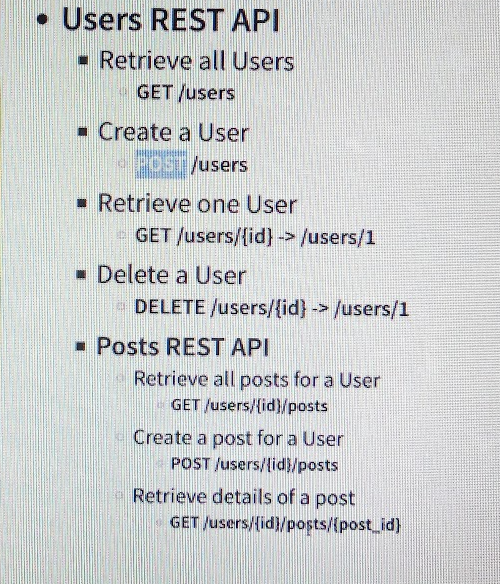
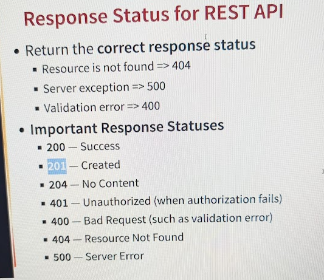

# Restful APIs

In this project we are going to be doing stuff with RESTful apis.

## What's happening in the background

### How are requests handled?

__DispatcherServlet__ → mapped to the root url "/". Will end up routing the traffic to the right controller and
Java Business logic. Dispatcher servlet is configured automatically with Spring Default shit.


### How are Java POJOs/Beans returned as JSON?

__@ResponseBody and JacksonHttpMessageConverters__

When we configure a class to be a RestController, the @ResponseBody is expected as the output of our methods.
So, spring knows that the returns of all the methods should be converted to JSON. What actually does the converting
is Jackson which is a tool that can work with XML and JSON.

### Using Path Params
```java
    @GetMapping(path = "/some/path/{name}")
    someGetMethod(@PathVariable String name) {
        return wtvJson(name);
    }
```
So. Looks like you just set the path param as {var} and then you specify that you want to use it by using the `PathVariable`
annotation.


### Designing REST Api Bull



These be the Methods we will be implementing :)


### Make POJO out of resources, e.g.: User and Post and Daos

Make User POJO. This is just a Java representation of the Database Resource. To actually interact with the Database
we use a DAO -> Data Access Object. Naming convention is <Resource>Dao or <Resource>DaoService i.e. `UserDao` or `UserDaoService`

### Response Codes.

I know this but I will still make note of this:



So to use the right response codes in our messages:

There is this concept of a `ResponseEntity` 

this is just a class that is already implemented by Spring
It is sort of the container for a Response. Instead of returning our object directly i.e. (`public User post()...`)
we would instead do `public ResponseEntity<User> post() ...` we can then apend more metadata to our response including
the response code.

for a `201 created` it looks something like:

```java

public ResponseEntity<User> post(@RequestBody User user) {
    service.post(user);
    return ResponseEntity.created(null).build();
}
```

You can add additional metadata within the `created` method (or whichever ResponseEntity method you choose). For example
you can specify the new URI for the user created i.e. `http://localhost:8080/users/{newlyCreatedID}` as part of the metadata.
Look at the code to see that.

#### Exceptions, 400 codes, and 500 codes - Exception Handling

All Spring MVC-based exceptions → that is if anything fails between request and response with our service, goes through
something called `ResponseEntityExceptionHandler` This thing returns formatted error details. One of the methods in this
class is called `handleException` and we can overwrite this method in our code to do some more customized exception handling


### Data Validation

In order to allow valid data, we need to do validation. Apparently Spring has its own starter project for validation:
`spring-boot-starter-validation` -> we bring that dependency into our pom.xml

We can then use the @Valid annotation in the following way:

```java
 // Post /users
    // Posts a user
    // RequestBody maps the request body to the POJO we expect. here we are expecting a user json to map to our
    // user POJO
    @PostMapping("/users")
    public ResponseEntity<User> post(@Valid @RequestBody User user) {
        // dao adds new user
        User newUser = userDao.post(user);

        // Get URI to new user
        URI location = ServletUriComponentsBuilder.fromCurrentRequest()
                .path("/{id}")
                .buildAndExpand(newUser.getId())
                .toUri();

        // return created 201 code along with new location of new user
        return ResponseEntity
                .created(location)
                .body(newUser);
    }
```

Then we define validation within our POJO (in this case user) and the validation is automatically invoked!

For example, here is `User` with validation added:

```java

import jakarta.validation.constraints.Past;
import jakarta.validation.constraints.Size;

import java.time.LocalDate;

public class User {
    private Integer id;

    @Size(min=2)
    private String name;

    @Past
    private LocalDate birthDate;
/**
 * The rest of the code is omitted since it is not necessary
 */
```

We can then define specific exception methods to send back specific information if a request is bad


## Swagger and OpenAPO
* 2 choices to generate documentation from code
* documents the REST API

Does this using the annotations and shit. Can simply throw in the following dependency and it just works!

```xml
<dependency>
	<groupId>org.springdoc</groupId>
	<artifactId>springdoc-openapi-starter-webmvc-ui</artifactId>
</dependency>
```
And then you can see the OpenAPI specification by clicking the definition at the top

## Content Negotiation

With REST APIs you hit a URI and then get back JSON (typically). Sometimes, a different client be expecting a different
format though. For example, we might want XML for some reason. ORR alternatively, we might want the response in a different
language.

Content Negotiation is about allowing the client to sort of tell the endpoint that we want the data back in a certain
lang or format.

### Accept application/xml

to return the xml, it's a simple as adding the following dependency:

```xml
<dependency>
	<groupId>com.fasterxml.jackson.dataformat</groupId>
	<artifactId>jackson-dataformat-xml</artifactId>
</dependency>
```
and voilà, you can request XML by adding the `Accept: aplication/xml` header to your request

### Accept Language Header

Internationationlization = i18n

Accept-Language header indicates the language that the consumer prefers.

I am not going to implement this. But basically, you control different values in property files for different langauges
and then you can pull the right property file using `org.springframework.context.MessageSource` to return the correct 
message you pull the locale from the header using `LocaleContextHolder` and `Locale`


## Versioning

## URI Versioning

Basically, you create a route with the version e.g.:
- `http://localhost:8080/v1/{blah}`
- `http://localhost:8080/v2/{blah}`

## Request Param Versioning

Basically, you create your routes to take a version variable:
- `http://localhost:8080/{blah}?version=1`
- `http://localhost:8080/{blah}?version=2`

## Custom Header versioning
Basically, expect a request header to tell you the version
- url-header -> X-API-VERSION=1
- url-header -> X-API-VERSION=2

## Mediatype Versioning (Content Negotiation)
Honestly I don't care enough.

## Spring Boot Versioning

For URI-based versioning, basically, you implement something like:

### In the java:
```java
@GetMapping(value="/{version}/somePath", version="1.0.0")
public SomeResource someMethod() {
    return new SomeResource();
}
```

### In the properties (application.properties)
```properties
spring.mvc.apiversion.use.path-segment=0
```

For query param based versioning, you do something like:

### In the java:
```java
@GetMapping(value="/somePath", version="1.0.0")
public SomeResource someMethod() {
    return new SomeResource();
}
```
### in the properties:
```properties
# here version is the query param variable we will be using i.e. localhost?version=1
spring.mvc.apiversion.use.query-parameter=version
```

You can also implement the other types of versioning, but idc enough

# HATEOAS

HATEOAS = Hypermedia as the Engine of Application State

Basically when you get a resource, HATEOAS is the paradigm that you should also get related actions you can perform on that
resource/resources related to the resource.

For example, when we GET a specific user using `localhost:8080/users/{id}`, we might also want to become aware of 
`localhost:8080/users` to get all users. To do this, we can update our `UsersController` class:

Some new classes we are using:
- `EntityModel` - This is a wrapper class that returns the Resource along with any extra metadata we want to add
we add this by adding `spring-boot-starter-hateoas` artifact to pom.xml
- `WebMvcLinkBuilder` - This is needed to link our controller methods with the metadata we add into the EntityModel

```java
    @GetMapping("/users")
    public List<User> get() {
        return userDao.get();
    }
    
    @GetMapping("/users/{id}")
    public EntityModel<User> get(@PathVariable Integer id) {
        User user = userDao.get(id);
        if (user == null) {
            throw new UserNotFoundException("User with id " + id + " is not found");
        }
        EntityModel<User> model = new EntityModel.of(user);
        WebMvcLinkBuilder allUsersLink = linkTo(methodOn(this.getClass()).get()); // notice that `.get` is the poorly named method that gets all users.
        model.add(allUsersLink.withRel("all-users")); // here the "all-users" is sort of the label we give to this link.
        return model;
    }
```

and when we make the request to ,say, user=2 `localhost:8080/users/2`, the response is something like:
```json
{
  "_links": {
    "all-users": {
      "href": "http://localhost:8080/users"
    }
  },
  "id": 2,
  "name": "Bella",
  "birthDate": "1995-02-10"
}
```

# Filtering

## Static Filtering
- __Removing a field from the response__:  
If for some reason a field should not be returned, the `@JsonIgnore` annotation can be added to the field, and it will
not be returned in the response.
Additionally, the `@JsonIgnoreProperties({"fieldName", "fieldName2"})` can be on the class as well.

## Dynamic Filtering
There is a concept called JSON Views. A view is a THING that you associate JSON fields to. For example if I have a Person
resource, there may be a Physical Characteristic View and a Personality View. I would associate the physical characteristics
of the JSON with the PhysicalCharacteristic View and personality traits with the PersonalityView. To do this, 
we create the Views in the following way. They are basically empty interfaces.

```java
public class View {
    public interface PersonalityView {
        
    }
    
    public interface PhysicalCharacteristicView {
        
    }
}
```

and in the bean code:

```java

public class Person {
    @JsonView(View.PhysicalCharacteristicView.class)
    private String height;
    @JsonView(View.PhysicalCharacteristicView.class)
    private String weight;
    @JsonView(View.PhysicalCharacteristicView.class)
    private String hairColor;
    @JsonView(View.PhysicalCharacteristicView.class)
    private String muscleMass;
    @JsonView(View.PhysicalCharacteristicView.class)
    private String fatPercentage;

    // energy level is both personality and physical
    @JsonView({View.PhysicalCharacteristicView.class, View.PersonalityView.class})
    private String energy;

    @JsonView(View.PersonalityView.class)
    private Boolean isFunny;
    @JsonView(View.PersonalityView.class)
    private String favoriteColor;
    @JsonView(View.PersonalityView.class)
    private String favoriteFood;

    // fake getters and setters
}
```

and then finally in the RestController code:

```java
import com.fasterxml.jackson.annotation.JsonView;

@GetMapping("/persons/{id}/personality")
@JsonView(View.PersonalityView.class)
public Person getPersonPersonality(@PathVariable Integer id) {
    // code gets the person, view does the filtering
}

@GetMapping("/persons/{id}/physical")
@JsonView(View.PhysicalCharacteristicView.class)
public Person getPersonPhysical(@PathVariable Integer id) {
    // code gets the person, view does the filtering
}
```


## Acutator

add `spring-boot-starter-actuator` to pom.xml and get several metrics endpoints for free on `localhost:8080/actuator`

in application.properties you manage the actuator endpoints you want to expose. a lot of them are not exposed by default

can expose all by doing `management.endpoints.web.exposure.include=*` 

There's a lot of metrics to get by defualt. wouldn't be surpised if you could define custom ones.